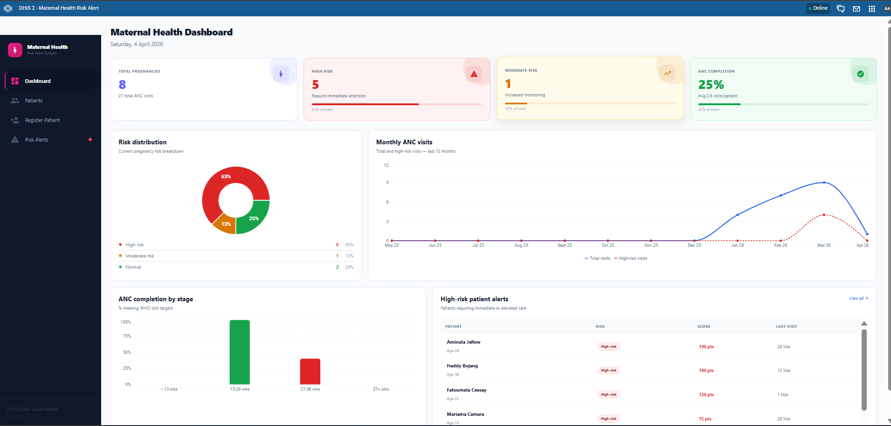
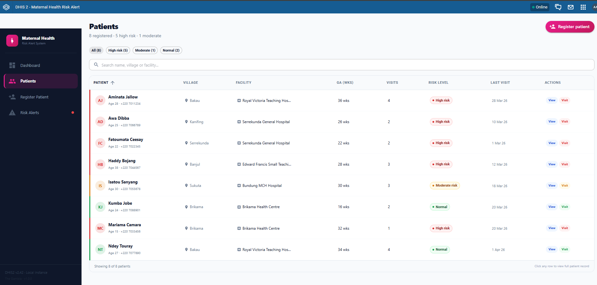
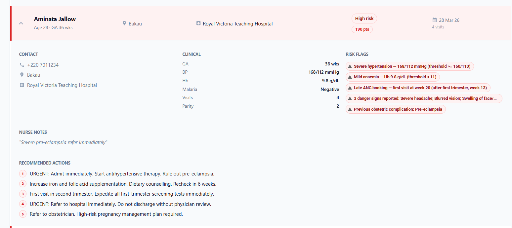
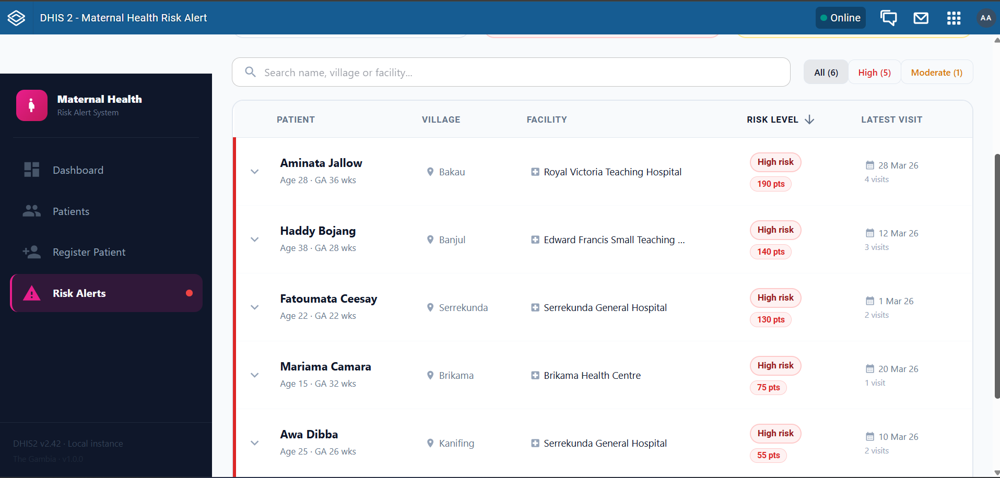
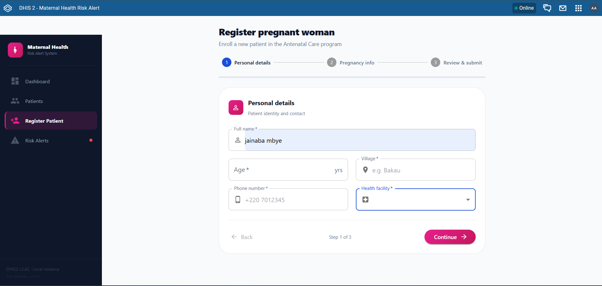

# Maternal Health Risk Alert System

A DHIS2 web application that automatically identifies high-risk pregnancies during antenatal care using evidence-based clinical rules.

## Available on DHIS2 App Hub

[Install from DHIS2 App Hub](https://apps.dhis2.org/app/maternal-health-risk-alert)

## Screenshots

### Dashboard


### Patient List


### Patient Detail with Trend Charts


### Risk Alerts


### Register Patient


## What it does

Health workers in antenatal clinics see many pregnant women every day. Identifying high-risk patients manually requires careful clinical assessment and can be time-consuming. High-risk cases may be identified too late.

This application automatically analyzes each patient's clinical data and flags high-risk pregnancies in real time the moment new data is entered. It uses evidence-based clinical rules to score pregnancy risk based on vital signs, clinical findings, and obstetric history. No manual analysis required.

## Features

- Register pregnant women as Tracked Entity Instances in DHIS2 Tracker
- Record ANC visits with blood pressure, haemoglobin, weight, malaria results and danger signs
- Automatic risk scoring using 9 evidence-based clinical rules
- Colour-coded risk alerts dashboard showing high, moderate and normal risk
- Patient visit history with blood pressure and haemoglobin trend charts
- Works on any DHIS2 instance v2.38 and above

## Risk engine

| Rule | Score |
|---|---|
| Severe hypertension BP 160/110 or above | +50 |
| Severe anaemia Hb below 7 g/dL | +45 |
| Active malaria infection | +40 |
| Hypertension BP 140/90 or above | +35 |
| Moderate anaemia Hb below 8 g/dL | +30 |
| Late ANC booking after 13 weeks | +20 to +30 |
| Adolescent pregnancy age under 18 | +25 |
| Danger signs reported | +25 per sign |
| Grand multiparity parity 4 or more | +15 |

## Tech stack

- DHIS2 App Platform
- React 18 and React Router v6
- Material UI v5
- Recharts v2
- DHIS2 Tracker API v42

## Setup

### Requirements

- Node.js v20 or higher
- A running DHIS2 instance v2.38 or above
- curl and base64 tools (for running setup script)

### Install

```bash
git clone https://github.com/mljadama/maternal-health-risk-alert.git
cd maternal-health-risk-alert
npm install
```

### Configure DHIS2 metadata

The app requires a Tracker program with ANC visits. You can either:

**Option 1: Use the provided setup script (creates demo data)**

Windows (PowerShell):
```powershell
# Update $SERVER in setup-dhis2.ps1 if not using localhost:8080
.\setup-dhis2.ps1
```

macOS/Linux (Bash):
```bash
# Update $SERVER in setup-dhis2.sh if not using localhost:8080
chmod +x setup-dhis2.sh
./setup-dhis2.sh
```

This script creates:
- ANC Program (Antenatal Care Tracker)
- ANC Visit Program Stage (repeatable)
- Tracked Entity Attributes (patient demographics)
- Data Elements (vital signs and test results)
- Organization Units (health facilities)

The script writes all UIDs to `src/config/dhis2.js`.

**Option 2: Manual configuration (use existing metadata)**

If you have an existing ANC Tracker program in your DHIS2 instance:

1. Find your program's UID in DHIS2 Maintenance → Tracker programs
2. Edit `src/config/dhis2.js` and update the UIDs:
   - `PROGRAM.id` - Your ANC Program UID
   - `PROGRAM_STAGE.id` - Your ANC Visit stage UID
   - `ATTRIBUTES` - Map to your tracked entity attributes
   - `DATA_ELEMENTS` - Map to your data elements
   - `ORG_UNITS` - Update to your organization units

### Start development server

```bash
npm start
```

### Build and install into DHIS2

```bash
npm run build
curl.exe -X POST "http://your-dhis2/api/apps" -u "admin:password" -F "file=@build/bundle/Maternal Health Risk Alert-1.0.0.zip"
```

## Why this was built

Maternal mortality remains a significant health challenge globally. The leading preventable causes include pre-eclampsia, severe anaemia, malaria in pregnancy, and late ANC booking. All are detectable early when the right clinical data is tracked systematically.

While DHIS2 is widely used for antenatal care data collection, no existing standard tool provides automated individual pregnancy risk assessment at the point of care. This application fills that gap by applying evidence-based clinical rules to track data in real time, helping health workers identify and manage high-risk pregnancies early.


## License

BSD 3-Clause