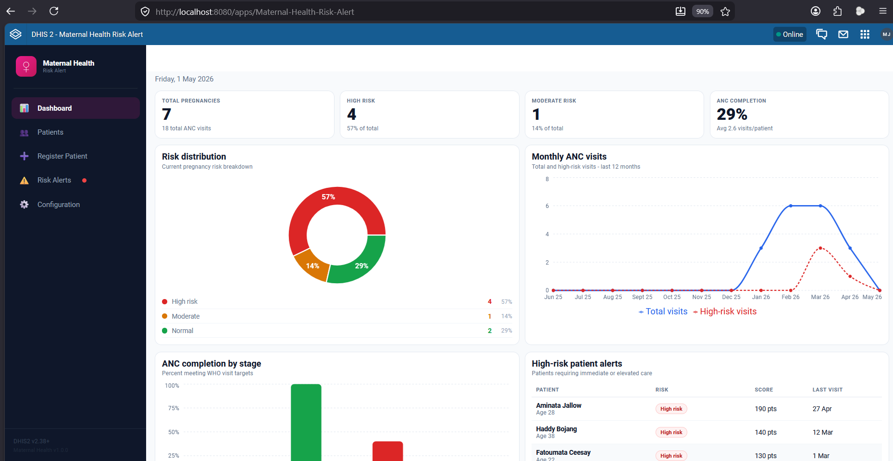
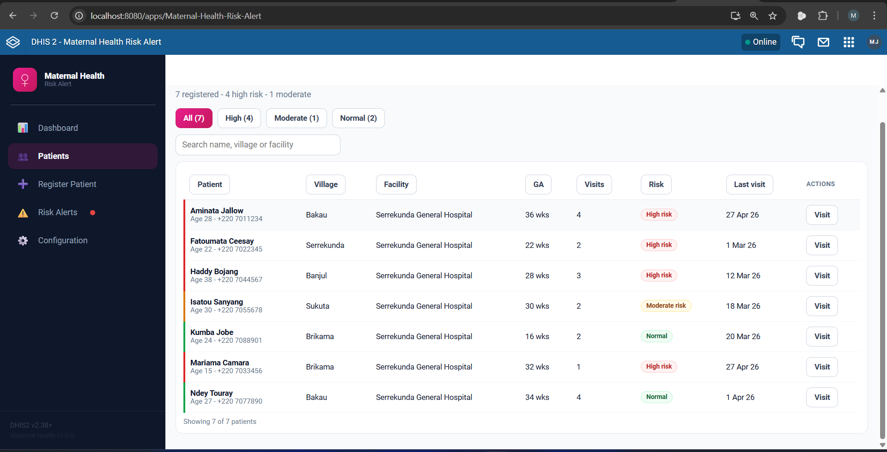
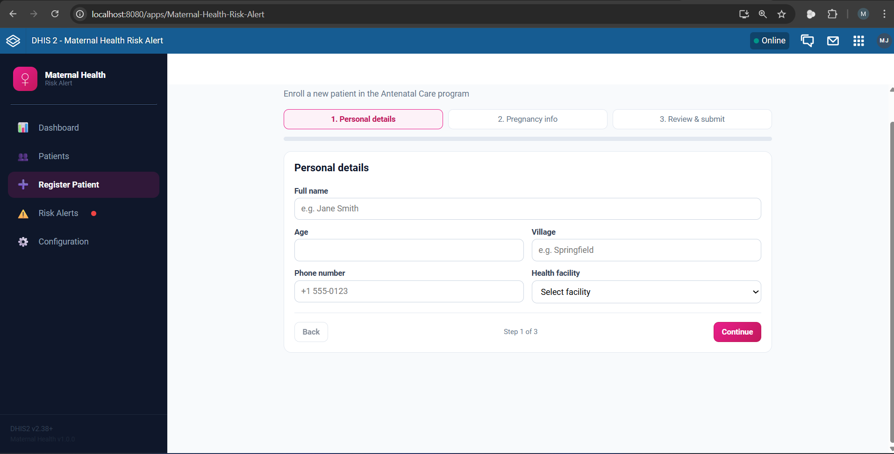
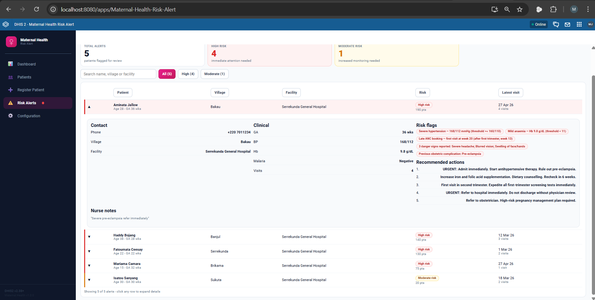

# Maternal Health Risk Alert

A DHIS2 app that scores antenatal care visits as they are entered and flags high-risk pregnancies so clinic staff can follow up sooner.

It was first built for antenatal care in The Gambia. You can map it to **any** DHIS2 Tracker antenatal program.

## What the app does

During a routine antenatal visit, a nurse records blood pressure, haemoglobin, malaria results, danger signs, and obstetric history. The app applies clinical rules and shows a colour-coded result:

- **High risk** — needs urgent attention
- **Moderate risk** — needs closer follow-up
- **Normal** — continue the usual antenatal schedule

Staff can register patients, record visits, view trends, and work from a risk-alerts list. Scoring weights, clinical cutoffs, and alert colours can be changed in the Configuration page.

## Who this README is for

| You are | Start here |
|---|---|
| Installing the app on a DHIS2 server | [Install from App Hub](#install-from-app-hub) |
| Connecting it to your antenatal program | [Configure the app](#configure-the-app) |
| Running it on your computer to develop or demo | [Run it locally](#run-it-locally) |

## Install from App Hub

1. Open [DHIS2 App Hub](https://apps.dhis2.org/?query=Maternal%20Health%20Risk%20Alert) and install **Maternal Health Risk Alert** (v1.0.3 or later).
2. In DHIS2, open **App Management** and confirm the app is installed.
3. Open the app from the DHIS2 apps menu.
4. Complete [configuration](#configure-the-app) before registering patients.

Requires DHIS2 **2.38 or later**. It has been verified on **2.40.8**.

You need permission to use Tracker programs and to write the app’s dataStore key (`maternal_health_risk_alert` / `config`). Ask a DHIS2 administrator if the Configuration page cannot save.

## Configure the app

The app does not assume Gambia (or any other country’s) metadata. On first use it asks you to map your instance.

1. Open **Configuration**.
2. Select your antenatal **tracker program** and visit **program stage**.
3. Map attributes (name, age, village, phone, parity, previous complications) and visit data elements (blood pressure, haemoglobin, weight, and the rest).
4. Optionally change risk scores, cutoffs, and colours.
5. Save. Settings are stored in DHIS2 dataStore on that server.

Until this mapping is valid, patient pages stay locked so the app cannot write to the wrong program.

### Demo metadata (optional)

If you want sample metadata instead of mapping an existing program, run the setup script against your DHIS2 server (default `http://localhost:8080`, user `admin` / `district`):

```bash
# Linux and macOS
chmod +x setup-dhis2.sh
./setup-dhis2.sh
```

```powershell
# Windows
.\setup-dhis2.ps1
```

The script attaches two demo clinics under an **existing** country-level organisation unit. It only creates a new root organisation unit if the server has none.

## Daily use

1. **Register patient** — name, age, village, facility, gestational age, parity. Phone number is optional; if entered it must be a valid number.
2. **Record visit** — blood pressure, haemoglobin, weight, and gestational age are required.
3. **Patients** and **Dashboard** — see who is enrolled and how risk is distributed.
4. **Risk alerts** — work through high and moderate cases.

## Screenshots

### Dashboard


### Patients list


### Register patient


### Risk alerts


## Default risk scores

These are the built-in scores. Change them in Configuration if your protocol differs.

| Rule | Default score | Typical level |
|---|---|---|
| Severe hypertension (BP 160/110 or above) | +50 | High |
| Severe anaemia (Hb below 7 g/dL) | +45 | High |
| Active malaria infection | +40 | High |
| Hypertension (BP 140/90 or above) | +35 | High |
| Moderate anaemia (Hb 7.0–7.9 g/dL) | +30 | High |
| Late ANC booking (after week 13) | +20 to +30 | Moderate / High |
| Adolescent pregnancy (age under 18) | +25 | High |
| Danger signs reported | +25 per sign | High |
| Grand multiparity (parity 4 or more) | +15 | Moderate |
| Previous obstetric complications | +15 to +25 | Moderate / High |

Default cutoffs: total score **40 or more** is high risk; **20 or more** is moderate risk.

## Why this project exists

The Gambia recorded 130 maternal deaths in 2025, many linked to conditions such as pre-eclampsia, severe anaemia, and malaria that can be detected during antenatal care. In busy clinics, risk identification still often depends on manual review. This app scores the visit as soon as the data is entered so high-risk patients are flagged immediately.

## Run it locally

You need **Node.js 20+**. For the bundled demo server you also need **Docker**.

```bash
git clone https://github.com/mljadama/maternal-health-risk-alert.git
cd maternal-health-risk-alert
npm install
```

### Option A — your own DHIS2

Point the app at a running instance, then start it:

```bash
npm start
```

The default proxy in `package.json` is `http://localhost:8080`. Open the URL printed in the terminal (usually `http://localhost:8081`). Log in with a DHIS2 user, then [configure the app](#configure-the-app).

### Option B — Docker DHIS2 on this machine

```bash
docker compose up -d
```

Wait until DHIS2 answers at `http://localhost:8080` (first start can take several minutes). Log in with `admin` / `district`, then seed demo metadata:

```bash
./setup-dhis2.sh
```

Then:

```bash
npm start
```

## Tests

```bash
npm test -- --watchAll=false
```

This runs unit tests for the risk engine, form validation, configuration, error messages, and colours.

## Build and install a zip

```bash
npm run build
```

The zip is written under `build/bundle/`. Install it in DHIS2 **App Management**, or upload it with:

```bash
curl -u "admin:district" -X POST "http://localhost:8080/api/apps" \
  -F "file=@build/bundle/Maternal Health Risk Alert-1.0.3.zip"
```

Replace the URL, username, and password for your server.

## License

BSD 3-Clause. See [LICENSE](LICENSE).
